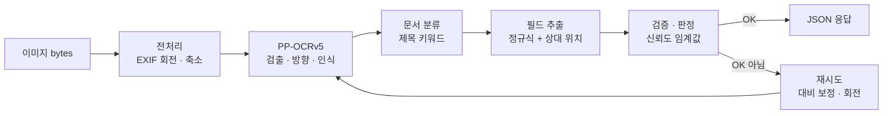

<div align="center">

# 🪪 korean-id-ocr

**주민등록증·운전면허증 앞면 이미지를 CPU만으로 읽어 구조화 JSON으로 돌려주는 OCR worker**

[](https://github.com/ydking0911/korean-id-ocr/actions/workflows/ci.yml)


</div>

---

## ✨ 특징

- **CPU 전용** — RapidOCR + PaddleOCR PP-OCRv5 한국어 ONNX 모델. PyTorch·Paddle·GPU 없이 동작
- **구조화 JSON** — 필드마다 값·신뢰도·위치(bbox)·검증 결과, 문서 단위 `OK` / `PARTIAL` / `FAIL` 판정
- **촬영 조건에 강함** — 대비 보정과 90°·270°·180° 회전 재시도, 기울어진 사진·쪼개진 줄·직인에 가린 글자 보정
- **개인정보 우선** — 이미지는 메모리에서만 처리, 로그 숫자 마스킹, read-only 컨테이너
- **재현 가능한 모델** — 매니페스트 + SHA256 검증, 빌드 시 이미지에 포함 (런타임 다운로드 없음)

## 📄 지원 문서

| 문서 | 추출 필드 |
|---|---|
| **주민등록증** 앞면 | 이름 · 주민등록번호 · 주소 · 발급일 · 발급기관 |
| **운전면허증** 앞면 | 면허번호 · 면허종류 · 이름 · 주민등록번호 · 주소 · 적성검사(갱신)기간 · 발급일 · 보안코드 · 발급기관 |

파생 값: 생년월일 · 성별 · 외국인 여부 · 면허 지역 · 기간 만료 여부. 전체 형식은 [응답 스키마](docs/05-output-schema.md).

## 📊 정확도 (합성 데이터 홀드아웃 300장)

| | 주민등록증 | 운전면허증 |
|---|---|---|
| 판정 OK | 98.7% | 94.7% |
| 핵심 필드 정답 (이름·주민번호·면허번호, 10개 촬영 조건 모두) | 100% | 100% |
| 전 필드 정답 (띄어쓰기 무시) | 94.7% | 78.0% |
| 처리 시간 p50 | 1.4초 (CPU 4코어 공유) | |

합성 데이터 기준이며 실물 성능은 아직 확인 전입니다. 자세한 내용은 [평가 결과](docs/11-evaluation.md).

## 🔍 동작 방식



## 🚀 빠른 시작

```bash
# 1. 모델 받기 (SHA256 검증)
python scripts/download_models.py

# 2. 빌드·기동 (127.0.0.1:8000에만 노출)
cp .env.example .env
docker compose up -d --build
curl http://127.0.0.1:8000/readyz

# 3. 신분증 이미지 → 구조화 JSON (이미지를 요청 본문으로 전송)
curl --data-binary @id.jpg -H "Content-Type: image/jpeg" http://127.0.0.1:8000/v1/ocr/id
```

<details>
<summary><b>응답 예시</b> (공개 견본 이미지)</summary>

```json
{
  "request_id": "2697051495a044929b4fb6b7b037ce96",
  "status": "OK",
  "document_type": "RESIDENT_CARD",
  "document_side": "FRONT",
  "fields": {
    "name": "홍길동",
    "name_hanja": null,
    "rrn": "800101-2345678",
    "address": "서울특별시 가산디지털1로 (대륭테크노타운 18차)",
    "address_lines": ["서울특별시 가산디지털1로", "(대륭테크노타운 18차)"],
    "issue_date": "2020-08-16",
    "issuer": "서울특별시 금천구청장"
  },
  "derived": { "birth_date": "1980-01-01", "sex": "F", "is_foreign_resident": false },
  "field_meta": {
    "name": { "found": true, "confidence": 0.9296, "bbox": [[127.2, 244.0], [432.8, 244.0], [432.8, 355.0], [127.2, 355.0]],
              "valid": true, "accepted": true }
  },
  "warnings": [],
  "fail_reason": null,
  "preprocess": { "exif_rotated": false, "scale": 1.0, "rotation": 0, "contrast_enhanced": false, "passes": 1 },
  "model": { "det": "ch_PP-OCRv5_det_mobile.onnx@sha256:4d97c44a20d3", "rec": "korean_PP-OCRv5_rec_mobile.onnx@sha256:cd6e2ea50f69",
             "cls": "ch_ppocr_mobile_v2.0_cls_mobile.onnx@sha256:e47acedf6632", "schema": "1.0" },
  "elapsed_ms": 948
}
```

`field_meta`는 일부만 표시. 값을 못 찾은 필드도 키는 유지하고 `null`.

</details>

## 🧩 API

| 메서드 | 경로 | 설명 |
|---|---|---|
| `POST` | `/v1/ocr/id` | 신분증 이미지 → 구조화 JSON. 디코딩 실패도 `200` + `status=FAIL` |
| `POST` | `/v1/ocr/raw` | 이미지 → 텍스트 줄·박스 (개발용, `IDOCR_ENABLE_RAW_ENDPOINT=true`일 때만) |
| `GET` | `/healthz` · `/readyz` | 프로세스 생존 · 모델 로드 완료 |

- 입력은 **요청 본문 그대로**(`image/jpeg`·`png`·`webp`). multipart는 업로드를 디스크에 임시 저장하므로 받지 않음
- 전송 계층 오류: `413` 너무 큼 · `415` 형식 · `503` 대기열 초과 · `504` 시간 초과

## ⚙️ 설정

환경변수 `IDOCR_*` (또는 `.env`).

| 변수 | 기본값 | 설명 |
|---|---|---|
| `IDOCR_OCR_WORKERS` | `2` | 동시 OCR 수 (엔진 인스턴스 수) |
| `IDOCR_ORT_INTRA_THREADS` | `3` | 엔진당 onnxruntime 스레드. workers × threads ≤ 코어 수 권장 |
| `IDOCR_RRN_OUTPUT` | `full` | `full` 또는 `masked`(`800101-2******`) |
| `IDOCR_ENABLE_RAW_ENDPOINT` | `false` | 원문을 그대로 돌려주는 `/v1/ocr/raw`. **운영에서는 끈다** |

<details>
<summary>전체 설정</summary>

| 변수 | 기본값 | 설명 |
|---|---|---|
| `IDOCR_THRESHOLD_NUMERIC` / `_TEXT` / `_ADDRESS` | `0.90` / `0.85` / `0.80` | 필드 채택 신뢰도 임계값 |
| `IDOCR_MAX_IMAGE_BYTES` | `10485760` | 요청 본문 상한 |
| `IDOCR_MAX_IMAGE_PIXELS` | `40000000` | 디코딩 픽셀 수 상한 |
| `IDOCR_MAX_SIDE_LEN` | `2000` | 긴 변이 이보다 크면 축소 |
| `IDOCR_RRN_CHECKSUM` | `warn` | 주민번호 검증번호 불일치 처리. `warn` = 경고만, `strict` = 주민번호 미채택(FAIL). 2020.10 이후 부여·변경 번호는 검증번호가 없다 |
| `IDOCR_MIN_SIDE_LEN` | `1000` | 긴 변이 이보다 작으면 확대 (작은 사진의 오인식 감소, `0`이면 끔) |
| `IDOCR_QUEUE_LIMIT` | `16` | 동시 대기 요청 상한 (초과 시 503) |
| `IDOCR_REQUEST_TIMEOUT_S` | `30` | 요청 처리 시간 상한 (초과 시 504) |
| `IDOCR_REQUIRE_HANGUL` | `true` | 인식 모델에 한글이 없으면 기동 거부 (잘못된 모델 로드 방지) |
| `IDOCR_USE_CLS` | `false` | 줄 단위 방향 분류. 짧은 줄을 뒤집힌 것으로 오판해 끔 (뒤집힌 사진은 180° 재시도가 처리) |
| `IDOCR_MODEL_DIR` | `models` | 모델 디렉터리 |
| `IDOCR_ADDRESS_LEXICON` | 없음 | 주소 교정용 추가 사전 (도로명·건물명 단어 목록 파일) |
| `IDOCR_LOG_LEVEL` | `INFO` | 로그 레벨 |

</details>

## 🛠 로컬 개발

```bash
python -m venv .venv && . .venv/bin/activate
pip install -e ".[dev]"
python scripts/download_models.py

pytest                                # 단위 + 실제 모델 테스트
python -m idocr.cli id id.jpg         # 구조화 결과
python -m idocr.cli raw id.jpg        # 텍스트 줄
uvicorn --factory idocr.service.app:create_app --port 8000
```

견본 이미지를 `samples/specimen/`에 두면 견본 변형(회전·기울기·축소·압축·밝기·흐림·배경) 테스트가 함께 돈다. `samples/`는 gitignore.

<details>
<summary>프로젝트 구조</summary>

```
src/idocr/
├─ config.py              환경변수 설정
├─ ocr/
│  ├─ engine.py           RapidOCR 래퍼 (모델 경로 명시, 글자 박스, 영역 재인식, 엔진 풀)
│  └─ preprocess.py       디코딩 · EXIF 회전 · 축소
├─ core/
│  ├─ text.py             주민번호·날짜·면허번호 등 정규화·검증
│  ├─ layout.py           박스 위치 비교 · 줄 묶기
│  ├─ classify.py         문서 종류 판별
│  ├─ extract/            주민등록증 · 운전면허증 추출기 (+ 공통 단계)
│  ├─ judge.py            필드 채택 · OK/PARTIAL/FAIL 판정 · 응답 조립
│  └─ pipeline.py         재시도 패스 (대비 보정 · 회전)
├─ privacy/logging.py     로그 숫자 마스킹 · 예외 타입명만 기록
├─ service/app.py         FastAPI
└─ cli.py                 로컬 확인용 CLI
scripts/download_models.py  모델 다운로드 · SHA256 검증
models/manifest.json        모델 목록 · 해시 (바이너리는 gitignore)
```

</details>

## 🧪 합성 데이터 · 평가

```bash
python -m tools.synth.assets        # 폰트 (OFL)
python -m tools.synth.template      # 견본 → 빈 템플릿 (samples/specimen 필요)
python -m tools.synth.generate --per-condition 15 --seed 1
python -m tools.evaluate --data samples/synthetic   # → samples/eval/latest/report.md
```

촬영 조건 10종(원근·회전·밝기·어둡게·흐림·저화질·반사광·배경·축소)으로 가짜 신분증을 만들고, 필드 정확도·오채택·신뢰도 임계값을 측정합니다. [합성 데이터 계획](docs/10-synthetic-data.md)

## ✅ 테스트 · CI

[GitHub Actions](.github/workflows/ci.yml)가 `main`·`develop` 푸시와 PR마다 실행한다.

| 작업 | 내용 |
|---|---|
| Unit tests | 정규화·추출·판정·재시도·API — OCR 없이 줄 목록으로 검증 |
| OCR tests | 모델 다운로드·해시 검증(캐시) 후 실제 모델로 렌더링 이미지 인식 |
| Docker build | 이미지 빌드 + 컨테이너 기동 · `/v1/ocr/id` 스모크 |

## 🔒 개인정보

- 이미지는 메모리에서만 처리하고 디스크에 쓰지 않는다
- 로그에서 6자리 이상 숫자열은 마스킹, 예외는 타입명만 기록 (OCR 결과가 섞이지 않도록)
- 컨테이너: read-only 루트 파일시스템, `/tmp`는 tmpfs, 코어 덤프 비활성화, non-root
- 실물 신분증 이미지는 저장소에 커밋하지 않는다

> 이 프로젝트는 신분증 위조나 타인 신분증 사용을 막지 못합니다. 주민등록번호 처리에는 법적 책임이 따르므로 용도에 맞게 사용하세요.

## 🗺 로드맵

| 단계 | 상태 |
|---|---|
| 1. Docker OCR worker | ✅ |
| 2. 주민등록증 앞면 구조화 | ✅ |
| 3. 운전면허증 앞면 구조화 | ✅ |
| 4. 합성 데이터 + 평가 하네스 (조건별 정확도, 임계값 보정) | ✅ |
| 5. 주소 사전 교정 → 필요 시 파인튜닝 | ❔ |

자세한 진행 현황은 [로드맵](docs/09-roadmap.md), 설계·결정 기록은 [`docs/`](docs/README.md).

## 🙏 사용한 오픈소스

- [RapidOCR](https://github.com/RapidAI/RapidOCR) · [PaddleOCR](https://github.com/PaddlePaddle/PaddleOCR) (PP-OCRv5 모델, Apache-2.0)
- [admdongkor](https://github.com/vuski/admdongkor) — 행정구역 이름 사전 (CC BY 4.0, `src/idocr/data/admin_names.json`)
- [ONNX Runtime](https://onnxruntime.ai/) · [FastAPI](https://fastapi.tiangolo.com/) · [OpenCV](https://opencv.org/) · [Pillow](https://python-pillow.org/)
